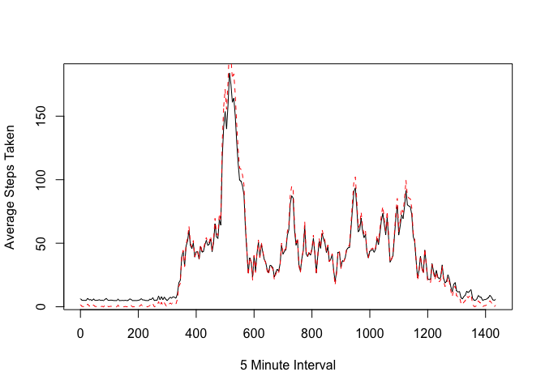
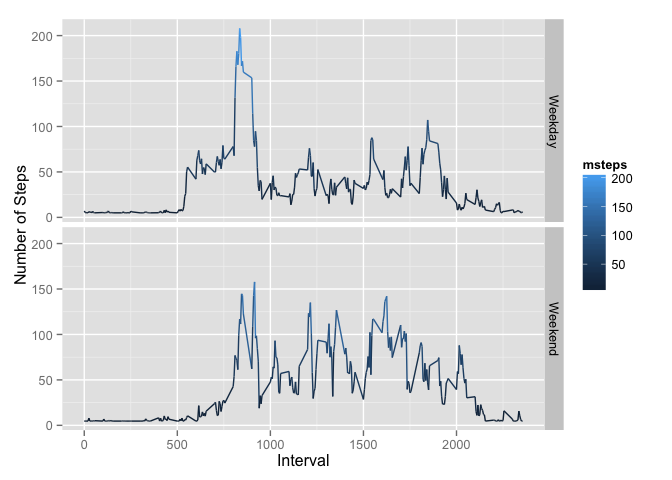

# Reproducible Research: Peer Assessment 1


## Loading and preprocessing the data

### Start by setting up the preliminary variables

```r
#variable setup (using generic set up across most assignments)
mURL <- "https://d396qusza40orc.cloudfront.net/repdata%2Fdata%2Factivity.zip"
mZipDest <- "activitydata.zip"
targetFile <- "activity.csv"
```

### Check for file existance
If the the target csv file `targetFile <- "activity.csv"` does not exist, download and unzip the zip file

```r
if(!file.exists(targetFile)){
  #retrive file from internet
  download.file(url = mURL, destfile = mZipDest, method = 'curl', quiet = TRUE)

  #extract zip file
  unzip(mZipDest)
}
```

### Read & Process
Since a later part of the assignment asks us to interpolate the NA values - we'll keep a full copy of the data as and we'll also store just the complete cases(e.g. `complete.cases()` omits any row entry that has an NA value)

```r
library(lubridate)
#at this point we have the csv let's read it in
activitydata <- read.csv(targetFile,header = TRUE)
```

For good measure we:
 * convert the date using `ymd()` from `lubridate`
 * convert the `interval` in `hhmm` to `totalminutes` using a simple sapply transform
    + failure to do this transform leads to misleading x-axis


```r
activitydata$dts <- ymd(activitydata$date)
activitydata$min <- activitydata$interval %% 100 + (floor(activitydata$interval/100)*60)
cleanedActivity <- activitydata[complete.cases(activitydata$steps),]
summary(cleanedActivity$steps)
```

```
##    Min. 1st Qu.  Median    Mean 3rd Qu.    Max. 
##    0.00    0.00    0.00   37.38   12.00  806.00
```

```r
which(is.na(cleanedActivity$steps))
```

```
## integer(0)
```

## What is mean total number of steps taken per day?

###  First a histogram of the total number of steps taken each day
Store the sum of  `dailySteps` by splitting our data frame on dates and using an `tapply` function; 


```r
dailySteps <- as.numeric(tapply(cleanedActivity$steps,cleanedActivity$date, sum))

hist(dailySteps, main='Daily Steps', breaks=10)
```

 

### Compute Median and Mean
Rather than computing the mean and median with two function calls - using `summary()` 

```r
mean(dailySteps, na.rm=TRUE)
```

```
## [1] 10766.19
```

```r
median(dailySteps, na.rm=TRUE)
```

```
## [1] 10765
```
## What is the average daily activity pattern?

### time series plot
"Get the dates into a plottable format"  

This is actually handled this much earlier, in the initial processing of the data, but here is the code again; relying on the `lubridate package`:  
 * First converting the date which is in yyyy-mm-dd format using `ymd()` from `lubirdate`  
 * Second create a date time stamp variable and set it to the "sum" of the date + the interval time - using the `eminutes()` function again provided by `lubridate`  

```r
  #activitydata$date <- ymd(activitydata$date)
#  activitydata$dts <- activitydata$date + eminutes(activitydata$interval)
```

Make a time series plot (i.e. type = "l") of
 * the 5-minute interval (x-axis) and 
 * the average number of steps taken, averaged across all days (y-axis)
**Note - the x-axis is no longer the default `interval` variable - it is now minutes elapsed during a given day which is stored in the `min` variables**

```r
  dayavg <- as.numeric(tapply(cleanedActivity$steps,cleanedActivity$min, function(x) mean(x, rm.na=TRUE)));
  plot(x = (unique(cleanedActivity$min)),
       y = dayavg, 
       xlab = '5 Minute Interval',
       ylab = 'Average Steps Taken',
       type = 'l'
      )
```

 

### locating max step interval
Which 5-minute interval, on average across all the days in the dataset, contains the maximum number of steps?  
 * First what's the max of the by-day-avg?  
 * Next at what index does it occur?  
 * That index, `maxidx` is the nth 5 minute increment; so `maxidx * 5 = time in minutes = maxtimemin`
 * Finally to convert back to `increments` for good measure, compute the number of whole hours
 * `floor(maxtimemin/60)` and the number of minutes `maxtimemin %% 60`
    + We also print the time in human readable format using sprintf

```r
max(dayavg)
```

```
## [1] 206.1698
```

```r
maxidx <- which.max(dayavg)
maxtimemin <- maxidx*5
maxtimemin
```

```
## [1] 520
```

```r
maxtimeincrement <- floor(maxtimemin / 60)*100 + maxtimemin %% 60
maxtimeincrement 
```

```
## [1] 840
```

```r
sprintf("%dh %dm", floor(maxtimemin / 60) , maxtimemin %% 60 )
```

```
## [1] "8h 40m"
```

## IMPUTE missing values

Note that there are a number of days/intervals where there are missing values (coded as NA). The presence of missing days may introduce bias into some calculations or summaries of the data.

### Total NAs
Calculate and report the total number of missing values in the dataset (i.e. the total number of rows with NAs)


```r
  nar <- is.na(activitydata$steps)
  naRows <- sum(nar)
  naRows
```

```
## [1] 2304
```

### filling missing values
Devise a strategy for filling in all of the missing values in the dataset. The strategy does not need to be sophisticated. *the mean for that 5-minute interval*
+ First a copy is made 
+ then find all the na locations using `which(is.na(...))`
+ the find the 5-minute interval (using the pure minute version stored in`$min`)
+ Next replace all the na `moddata$steps` locations with integers computed using the mean across all days and increments


```r
  moddata <- activitydata
  nalocs <- which(is.na(moddata$steps))
  namints <- moddata[nalocs,]$min
  moddata[nalocs,]$steps <- mean(moddata$steps, na.rm=TRUE)
```
#### Verify that the daily average hasn't changed:

```r
moddayavg <- as.numeric(tapply(moddata$steps,moddata$min, mean));
  
  plot(x = (unique(moddata$min)),
       y = moddayavg, 
       xlab = '5 Minute Interval',
       ylab = 'Average Steps Taken',
       type = 'l',
      )
  lines(x = (unique(moddata$min)),
        y = dayavg,
        col='red',
        type ='l',
        lty=2
        )
```

 

### new dataset
Create a new dataset that is equal to the original dataset but with the missing data filled in.

+ Make a histogram of the total number of steps taken each day 
+ and Calculate and report the mean and median total number of steps taken per day. 


```r
moddailySteps <- tapply(moddata$steps,moddata$date, sum) 
hist(moddailySteps, xlab='Modified STEP Data', breaks=10)
```

 

### Compute Median and Mean
Rather than computing the mean and median with two function calls - using `summary()` 
+ First summary is the new data (with NA's replaced)
+ Second summary is the orginal data (with NA's removed)

```r
mean(moddailySteps)
```

```
## [1] 10766.19
```

```r
mean(dailySteps, na.rm=TRUE)
```

```
## [1] 10766.19
```

```r
median(moddailySteps)
```

```
## [1] 10766.19
```

```r
median(dailySteps, na.rm=TRUE)
```

```
## [1] 10765
```

### Impact of imputing missing data
Do these values differ from the estimates from the first part of the assignment?

*Since we used the arithmetic mean of all steps across all days - the mean does not change.*  
*The median shifts slightly ~ 1 step*

What is the impact of imputing missing data on the estimates of the total daily number of steps?  
*Increased daily step frequency near the mean*  


## Are there differences in activity patterns between weekdays and weekends?
**YES**  

Create a new factor variable in the dataset with two levels -- "weekday" and "weekend" indicating whether a given date is a weekday or weekend day.


```r
library(plyr)
```

```
## 
## Attaching package: 'plyr'
## 
## The following object is masked from 'package:lubridate':
## 
##     here
```

```r
  moddata$daytype <- factor(sapply(moddata$dts, function(x) if(weekdays(x)=="Sunday"||weekdays(x)=="Saturday"){"Weekend"}else{"Weekday"}))
avgStepsPermin <- ddply(moddata, .(min, interval,daytype), 
    summarize, msteps = mean(steps))
```

###Plot
Make a panel plot containing a time series plot (i.e. type = "l") of the 5-minute interval (x-axis) and the average number of steps taken, averaged across all weekday days or weekend days (y-axis). 

*note using ggplot2 rather than lattice so the panel labels are on the right not centered*


```r
library(ggplot2)

ggplot(avgStepsPermin, aes(x = interval, y = msteps), type='l') + 
    geom_line(aes(colour=msteps)) + facet_grid(daytype~ .) + 
    xlab("Interval") + ylab("Number of Steps") 
```

 

Significant differences in weekdays - peak steps around 9AM near 200 steps; with increasing periodic steps counts near 12, 3PM, and 8PM.  
On weekends max steps ~150  with 4 main cycles at 9AM, 12, 1PM, 3PM.  
Hypothesis: During the week this person walks in the morning before sitting at a desk and walks at regular intervals. On weekends, they're more mobile but don't have a long upfront walk in the morning.

